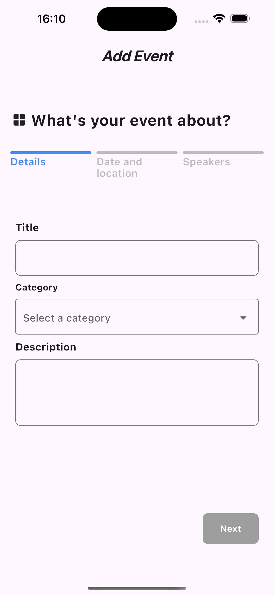
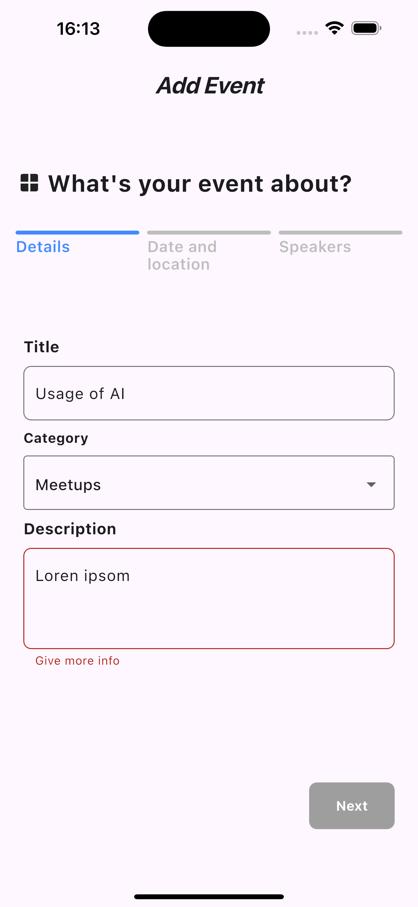
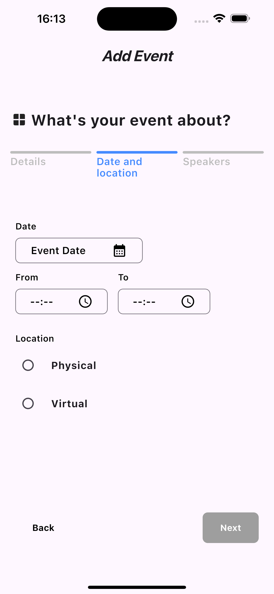
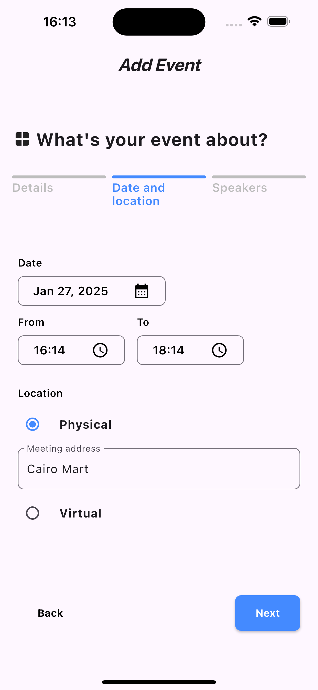
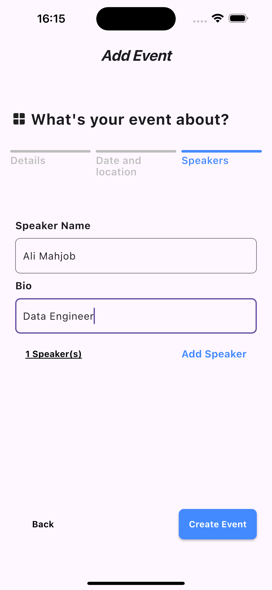
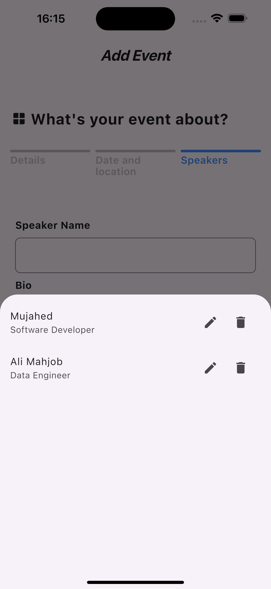
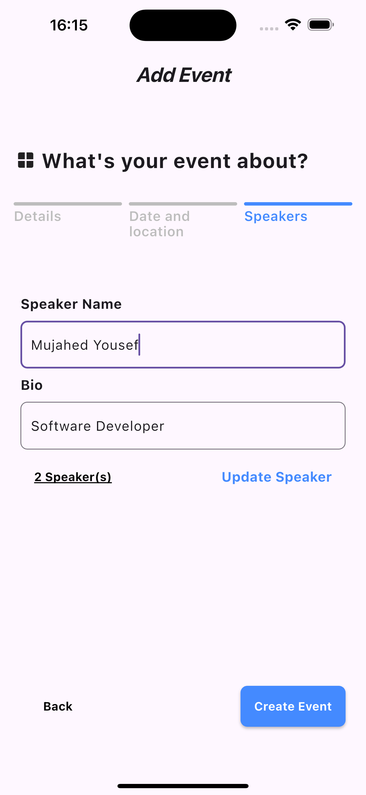

# fire_playground

Exploring Firebase services

___

## 1 Event Creation

A Flutter app that allows users to create events in three simple steps: **Details**, **Date & Location**, and **Speakers**. The event data is stored in Firebase Firestore for real-time access and management.

___

## **Screenshots**

### Step 1: Event Details

_

### Step 2: Date & Location

_

### Step 3: Speakers

